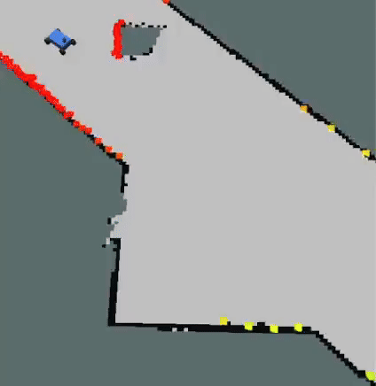

| **Deliverable**  | **Due Date**                                 |
|---------------|----------------------------------------------------------------------------|
| 6x `TEST_NAME_log.npz` files on [Gradescope](https://www.gradescope.com/courses/973988) | Wednesday, February 26th at 1:00PM EST |
| In-person Lab Checkoffs | Wednesday, February 26th, during lab |

# Lab 2: Wall Following in Simulation

## Table of Contents
- [Introduction](https://github.com/mit-rss/wall_follower_sim#introduction)
- [Downloading](https://github.com/mit-rss/wall_follower_sim#download-this-repository)
- [Running](https://github.com/mit-rss/wall_follower_sim#running)
    - [1. Running the Simulator](https://github.com/mit-rss/wall_follower_sim#1-running-the-simulator)
    - [2. Running your Wall Follower](https://github.com/mit-rss/wall_follower_sim#2-running-your-wall-follower)
    - [3. Running the Tests](https://github.com/mit-rss/wall_follower_sim#3-running-the-tests)
- [Lab Overview](https://github.com/mit-rss/wall_follower_sim#lab-overview)
- [Steps to Success](https://github.com/mit-rss/wall_follower_sim#steps-to-success)
- [Submission](https://github.com/mit-rss/wall_follower_sim#submission)
- [Troubleshooting and Other Notes](https://github.com/mit-rss/wall_follower_sim#troubleshooting-and-other-notes)
- [Frequently Used Instructions](https://github.com/mit-rss/frequently_used_instructions)

<br />


## Introduction

[[Link to Lab Slides]](https://docs.google.com/presentation/d/1PAG9HPgg0wHRsm3TJ2rP1a3a17MZg4Sk/edit?usp=sharing&ouid=106827498769638621680&rtpof=true&sd=true)

In this lab, you will be implementing a wall follower on a simulated racecar. Your goal is to make an autonomous controller that drives the racecar forwards while maintaining a constant distance from a wall on either its left or right (chosen on the fly). It should be robust to uneven surfaces and small errors in the LIDAR data, and it should be able to recover from deviations from the desired state; being too far, too close, or too angled.



This lab should be done individually. In the next lab, you will join your team to get your wall follower working on the real racecar. You may reuse code you write for this lab so make sure it is clean and presentable to your teammates!

We have made a series of tests to evaluate the performance of your wall follower. In order to test your code properly you must start with the template starter code. The template is still very sparse and you have plenty of freedom to implement any algorithm you'd like so long as the inputs and outputs are the same.

<br />

## Download this Repository

Clone this repository into your colcon workspace:

    cd ~/racecar_ws/src
    git clone https://github.com/mit-rss/wall_follower_sim.git

Then rebuild your workspace with `colcon build`:

    cd ~/racecar_ws
    colcon build --symlink-install
    source install/setup.bash

We ask that you use the starter code contained in this repo and do not tweak its original structure. Make sure that your wall follower lives in the ROS node initialized in the Python script at:

    wall_follower/wall_follower.py

However, feel free to add more Python files to keep your code organized.


<br />

## Running

### 1. Running the Simulator

First, open [`rviz`](http://wiki.ros.org/rviz) using the right-click menu in the NoVNC browser graphical interface (which can be accessed at http://localhost:6080/vnc.html?resize=remote after the docker container is started). 

Launch the [racecar simulator](https://github.com/mit-racecar/racecar_simulator) by running (from any directory):

    ros2 launch racecar_simulator simulate.launch.xml

Note that you must open `rviz` ***before*** you launch the racecar simulator for the map to appear (since the map only is published once when the simulator is started).

You should see a car in a map (walls are black, empty space is grey) and colorful points on that map representing lidar detections.


You can change the position of the robot by clicking the "2D Pose Estimate" button on top of rviz and placing the arrow somewhere on the map.


### 2. Running your Wall Follower

    ros2 launch wall_follower wall_follower.launch.xml

***Note that you can modify and rerun your wall follower without needing to restart the simulator. Run the simulator once... and leave it running.***

### 3. Running the Tests

There are 6 test cases, with varying start and end positions, velocities, wall-side, and desired distances.

You will run your tests locally and submit the log.npz files that the tests generate. 

First, launch the test simulator:

    ros2 launch wall_follower launch_test_sim.launch.py

Then, launch the tests (which will automatically launch your wall follower as well):

    ros2 launch wall_follower launch_test.launch.py

You can view the tests running in `rviz`. Note that you can visualize the target end position by adding the "/end_position_marker" topic to rviz.

For an example of how the tests should look when running, see [this video](https://youtu.be/r7ygU1zlTjU). 

If you're curious, the tester code is in `/wall_follower_sim/wall_follower/test_wall_follower.py` 

**Note that, while the simulator does not simulate collisions, the autograder will check that your car has not crashed.**

<br />

## Lab Overview

All instructions detailed here should happen in your docker container.

### 1. Send Drive Commands

To make the car drive, publish messages of type [`AckermannDriveStamped`](http://docs.ros.org/jade/api/ackermann_msgs/html/msg/AckermannDriveStamped.html) to the `/drive` topic.
    
Import the `AckermannDriveStamped` type like this in your `wall_follower.py` file:

    from ackermann_msgs.msg import AckermannDriveStamped
    
### 2. Read LIDAR Data

The racecar has a 2D LIDAR sensor that measures distances from the racecar to its surroundings. All LIDAR data is published to the `/scan` topic by the simulator (so you should only need to subscribe to this topic).

The data is of type [`LaserScan`](http://docs.ros.org/api/sensor_msgs/html/msg/LaserScan.html). You can import the type in python using:

    from sensor_msgs.msg import LaserScan

The `ranges` entry in the `LaserScan` message  is an array of the distances from the lidar sensor to the nearest obstacle. The measurements are taken at regular angular intervals of `angle_increment` radians, from the angle `angle_min` to `angle_max`.

The rainbow points in this image below are the laser scan as visualized in `rviz`. The color corresponds to the intensity of the scan. In the simulator this is simply the distance, but on the actual lidar it gives you an indication of how reflective the object you are scanning is. Note that there is no data in the quadrant behind the car because the LIDAR sensor does not scan the full 360 degree range.


### 3. Use the Simulator Parameters

There is a [params.yaml](https://github.com/mit-rss/wall_follower_sim/blob/master/wall_follower/params.yaml) file that defines a few parameters for your wall-follower. Most notably:

* `desired_distance`: distance that the racecar should maintain from the wall
* `velocity`: speed the racecar should move in meters per second
* `side`: The side the wall is following represented as an integer. +1 represents the left wall and -1 represents the right wall. We chose this convention because typically we will assume the car is pointing in the positive _x_ direction. That means the left side of the car will point to the positive _y_ axis and the right side will point to the negative _y_ axis.  

Not only is this param file useful for efficiently testing different configurations, **it is NECESSARY for the autograder**! Therefore, your wall follower must fetch and use these parameters so that the autograder can test the various test cases.

(Note: the `scan_topic` and `drive_topic` parameters are optional, though defining topic names in a param file is generally good practice).

<br />

## Steps to Success
How you implement the wall follower is entirely up to you. However, these are some key tips we compiled that will set you in the right direction:

* __One step at a time__: Begin by setting up your wall follower node so that it subscribes to laser messages and publishes steering commands. Make sure you can move the racecar at a constant speed and turning angle before working on your controller.
* __Slice up the scan__: Only a subset of the laserscan points will be useful to you -- how you filter these points will ***significantly*** impact your wall follower's performance. Think carefully about which laserscan points matter -- should you threshold by angle? by distance? by x- and y- coordinate (relative to the `base_link` frame)? Seriously, draw it out (based on the test cases) and think it through. When filtering the laserscan points, Try to use [```numpy```](https://numpy.org/) operations rather than for loops in your code. [Multidimensional slicing](https://docs.scipy.org/doc/numpy-1.13.0/reference/arrays.indexing.html) and [broadcasting](https://docs.scipy.org/doc/numpy-1.13.0/user/basics.broadcasting.html) can make your code cleaner and much more efficient.
* __Find the wall__: In a perfect world, you might be able to detect the wall by fitting a line to 2 samples of the LIDAR data. However with noisy data and uneven surfaces this might not be enough. A [least squares regression](https://en.wikipedia.org/wiki/Simple_linear_regression) is an easy way to account for more noise. The [RANSAC](https://en.wikipedia.org/wiki/Random_sample_consensus) outlier-rejection algorithm can further “upgrade” an existing model (like least squares). _Note: Attempt RANSAC only if you've already built a functional wall follower. It is probably overkill._
* __Use PD or PID control__: There are multiple ways to implement your control logic; for example, PID control can be used to stabilize your robot to a fixed distance from a wall, while Pure Pursuit with Ackermann dynamics can be used to follow a path defined by the wall. While both methods work, PD/PID control is more well-known for handling disturbances like curved walls and corners. Simple P (proportional) control is often not enough to create a responsive and stable system. Tuning the constants of this system can be done through empirical observations or more [systematically](https://www.crossco.com/resources/technical/how-to-tune-pid-loops/).
* __Use the visualization code__: We provided an example Python script in `wall_follower` that plots a line in Rviz. You can write something similar to this in order to make sure your code (e.g. wall detection) is working!


## Submission

Running the tests (see [[3. Running the Tests]](https://github.com/mit-rss/wall_follower_sim#3-running-the-tests)) will generate 6 log files that will appear in your ROS2 workspace home: `racecar_docker/home/racecar_ws/TEST_NAME_log.npz` Submit all 6 test files to the [gradescope assignment](https://www.gradescope.com/courses/728544). 

(If you have not generated all the files because you have not passed all the tests, you can still get partial points from submitting whatever files you do have.)


<br /><br />

## Troubleshooting and Other Notes

#### When in doubt:

Try restarting both the simulator and your wall follower node. We've seen strange issues where the laser scan publisher seems to stop working... a simple restart of the simulator node fixes this.


#### Simulator Parameters

You may have noticed that the simulator has a few parameters defined in [params.yaml](https://github.com/mit-racecar/racecar_simulator/blob/master/params.yaml):

- `max_speed`: 4 meters/second
- `max_steering_angle`: 0.34 radians

You generally should not modify these; they will be reset by the autograder.

<br />


#### If you don't see the car appearing in the rviz simulation:
Firstly, confirm that the simulator (`ros2 launch racecar_simulator simulate.launch.xml`) is running successfully.

If so, if you're using the [racecar docker image](https://github.com/mit-racecar/racecar_docker), Rviz will already be configured to visualize the simulator. But if not, in the left panel on the bottom click the "Add" button, and then in the "By display type" tab click "RobotModel". You should see a small blue car appear. Then click "Add" again and in the "By topic" tab click add the "/map" topic.  Repeat once more to add the laser scan topic. Under the dropdown menu of your LaserScan there should be a field called "Size (m)". Change this to 0.1 so you can see the laser scan more clearly. The checkboxes turn on and off display types, which may be useful as you add topics to visualize.


